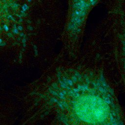
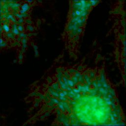

# Dual-Branch Zero-Shot Learning for Denoising in Fluorescence Lifetime Imaging Microscopy

## Data
### What Kind of Data I Need 
- I aim to mimic the approach from zero-shot methodologies, which means I only perform verification work.
- BPAE/3T3/Any other commonly used biological sample in FLIM/Confocal
- I & Q & A
### What Kind of Data I Have 
- MPG data 
- Natural Image Photo Data (CCD/CMOS)
- Some data Varum has used

The idea is to train A, but with the relationship between I & Q, we could possibly adopt a zero-shot learning-ish strategy.

All learning is based on the feature of A, so the feature I is the kernel. In FLIM, you must have an A to estimate g&s -> I&Q. 

Since we do not have complete pairs of (I,Q,A -> A (GT)), we do not even have such a thing, the best we can do is:
    
- Use MPG pretrained model for I/Q -> A optimization 
- Provide fine-tune purpose data (generated by myself) with (noised I / Q / A) -> (50 or even more averaged I/Q/A) 
- With other applications (which are not limited to FLIM) [May be a separate paper]
- **What if the input is g&s**?
- [ ] g & s & I & Q & A (stacks)

## Loss function Design
- [x] use their physical relationship
- [x] loss1 = alpha * MSE(A,A') +  **MSE(Q,Q') + MSE(I,I')**
- [ ] loss2 = alpha * MSE(A,A') +  LPF(Q,Q') + LPF(I,I') (only for sturcture loss and information learning or try GAN loss)
- [ ] Potential ZS Learning for Intensity -> Try the way from ZS-N2N (not work, seems only deal with adding noise but not natural/physical noise)

### Validation of the Model and Performance
- Most validation is to present the data with some great figures.
- PSNR // SSIM could be used, anyway we have a pair of input & output.
- Compare with primitive results.

## Experiments

### Loss1 Results
Version: 1.01 -- runable results

```bash
python3 main.py --FLIM --root './FLIM_dataset' --types 'BPAE_Sample1' --epochs 500 --lr 1e-1 --alpha 0.8
```



## TODO
- [x] Few-shot Paper Reading
- [x] Learn about how we could apply some vectors for this project
- [x] And during the learning process, there should be no I and Q been seen by the network (Make sure it is a zero-shot learning)
- [x] If the I and Q are joined in the learning process, it should be not called ***Zero-Shot***, since it is a part of learning and been seen by system. But in our case
- [x] Rethink about the network: like if input is I and Q and output is the clean A and how we make use of noisy A in this network?

